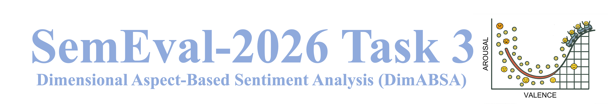

<figure>
  
</figure>
<!-- <figure>
  
</figure> -->

# Content
- [Overview](#overview)
- [Task Description](#task-description)
    - [Track A](#track-a-dimabsa) ([Subtask 1](#subtask-1-dimensional-aspect-sentiment-regression-dimasr), [Subtask 2](#subtask-2-dimensional-aspect-sentiment-triplet-extraction-dimaste), [Subtask 3](#subtask-3-dimensional-aspect-sentiment-quad-prediction-dimasqp))
    - [Track B](#track-a-dimabsa) ([Subtask 1](#subtask-1-dimensional-aspect-sentiment-regression-dimasr), [Subtask 2](#subtask-2-dimensional-aspect-sentiment-triplet-extraction-dimaste)) 
- [Datasets](#datasets)
- [Evaluation](#evaluation)
- [Full List of Aspect Categories](#full-list-of-aspect-categories)
- [Important Dates and Task Phases](#important-dates-and-task-phases)
- [Resources](#resources)
- [References](#references)


#  Quick Start

- [Join the Google Group for the task](https://groups.google.com/g/dimabsa-participants) | [Join Discord](https://discord.gg/xWXDWtkMzu) 
- **Track A – Dimensional Aspect-Based Sentiment Analysis (DimABSA)**: Predict real-valued **valence–arousal (VA)** scores for aspects and extract their associated information from text. Its subtasks include:   
  1. Subtask 1: DimASR – Dimensional Aspect Sentiment Regression  
  2. Subtask 2: DimASTE – Dimensional Aspect Sentiment Triplet Extraction  
  3. Subtask 3: DimASQP – Dimensional Aspect Sentiment Quad Prediction  
- **Track B – Dimensional Stance Detection (DimStance)**: A Stance-as-DimABSA task, where the target in stance detection is treated as an aspect. Its subtasks include:
  1. Subtask 1: DimASR for stance analysis  
  2. Subtask 2: DimASTE for stance analysis  
- **Data**: JSONL format (train/dev/test sets).  
- **Evaluation**: For both tracks, RMSE is used for Subtask 1, and a new metric (continuous F1) for Subtasks 2&3.  
[Join the Google Group for the task](https://groups.google.com/g/dimabsa-participants)| [Join Discord](https://discord.gg/xWXDWtkMzu) | [Create an Issue](#) | [Contact Us](mailto:dimabsa-organizers@googlegroups.com) | [Download Dataset](#) | [How to Participate](#)|

# Overview

Aspect-Based Sentiment Analysis (ABSA) is the task of identifying aspect terms in text and determining their associated sentiment polarity (Zhang et al., 2023). However, current ABSA research predominantly adopts a coarse-grained, categorical sentiment representation (e.g., positive, negative, or neutral). This approach stands in contrast to long-established theories in psychology and affective science (Russell, 1980; 2003), where sentiment is represented along fine-grained, real-valued dimensions of **valence** (ranging from negative to positive) and **arousal** (from sluggish to excited), as illustrated in Fig. 1.

This valence-arousal (VA) representation has inspired the rise of dimensional sentiment analysis as an emerging research paradigm (Mohammad, 2018; Lee et al., 2022, 2024; Muhammad et al., 2025), enabling more nuanced distinctions in emotional expression and supporting a broader range of applications.


<p align="center">
  <br>
  Fig. 1. Two-dimensional valence-arousal space (Yu et al., 2016).
</p>


To bridge this gap, we propose **Dimensional ABSA (DimABSA)**, a shared task that integrates dimensional sentiment analysis into the traditional ABSA framework. Furthermore, there is a conceptual similarity between stance detection and ABSA when the stance target is treated as an aspect. Building on this, we introduce **Dimensional Stance Detection (DimStance)**, a Stance-as-DimABSA task that reformulates stance detection under the ABSA schema in the VA space. This new formulation extends ABSA beyond consumer reviews to public-issue discourse (e.g., social, political, energy, climate) and also generalizes stance analysis from categorical labels to continuous VA scores. 

# Task Description

This shared task is organized into two complementary tracks: **DimABSA** and **DimStance**. Each track provides a benchmark for evaluating fine-grained, structured, and affect-aware opinion mining systems.

## Track A: DimABSA  

This track extends traditional ABSA tasks by replacing categorical sentiment labels with real-valued VA scores, enabling more nuanced analysis of opinions tied to aspects. We have three subtasks under this track:

- **Subtask 1: Dimensional Aspect Sentiment Regression (DimASR).**  
  Given a text and one or more aspects, predict a real-valued *VA score* for each aspect. This extends Aspect Sentiment Classification (ASC) [Pontiki et al., 2014; 2015; 2016].  

- **Subtask 2: Dimensional Aspect Sentiment Triplet Extraction (DimASTE).**  
  Extract *(aspect term, opinion term, VA score)* triplets from text. This extends Aspect Sentiment Triplet Extraction (ASTE) [Peng et al., 2020].  

- **Subtask 3: Dimensional Aspect Sentiment Quad Prediction (DimASQP).**  
  Extract *(aspect term, aspect category, opinion term, VA score)* quadruplets from text. This extends Aspect Sentiment Quad Prediction (ASQP) [Cai et al., 2021; Zhang et al., 2021].  

The elements to be predicted in the new subtasks are described as follows.
- **Aspect Term**: A word or phrase indicating an opinion target, such as *appetizer*, *waiter*, *battery*, or *screen*.
- **Aspect Category**: An abstract or predefined category to which an aspect term belongs. It follows the format *Entity#Attribute*, where the *Entity* (e.g., FOOD, SERVICE) and *Attribute* (e.g., PRICES, QUALITY) are selected from predefined lists (Pontiki et al., 2015; 2016). For all valid combinations, see the [full list of aspect categories](#full-list-of-aspect-categories).
- **Opinion Term**: A sentiment-bearing word or phrase associated with a specific aspect term, such as *great*, *terrible*, or *satisfactory*.
- **Valence-Arousal (VA)**: A pair of real-valued scores, each ranging from **1.00 to 9.00**, rounded to two decimal places.  
    - **Valence (V)**: Measures the degree of positivity or negativity.  
    - **Arousal (A)**: Measures the intensity of emotion.  
    A score of **1.00** indicates extremely negative valence or very low arousal, **9.00** indicates extremely positive valence or very high arousal, and **5.00** represents a neutral valence or medium arousal.

## Track B: DimStance  

<!--
This track reformulates **stance detection** under the ABSA schema in the VA space. Traditional stance detection identifies whether a speaker is *in favor of*, *neutral toward*, or *against* a target entity [Mohammad et al., 2017]. We introduce **DimStance**, which adapts this task as follows:
-->

Given an utterance or post and a target entity, stance detection involves determining whether the speaker is in favor or against the target (Mohammad et. al., 2017). This track reformulates stance detection as a **Stance-as-DimABSA** task with the following transformations: 

1. The stance target is treated as an aspect.  
2. Discrete stance labels are replaced with continuous VA scores.  
3. Opinion terms are incorporated to align with the ABSA structure.  

Based on this formulation, we define two subtasks equivalent to those in Track A, with the stance target regarded as the aspect.
 
- **Subtask 1: Dimensional Aspect Sentiment Regression (DimASR).**  
  Given a text and one or more aspects (targets), predict a real-valued *VA score* for each aspect, reflecting the stance expressed by the speaker toward it.   

- **Subtask 2: Dimensional Aspect Sentiment Triplet Extraction (DimASTE).**  
  Extract *(target/aspect term, opinion term, VA score)* triplets from text.  


  
The subtasks shared in both Track A and Track B are described below. Participants may choose to participate in one or more, depending on their research interests or application focus.

## Subtask 1: Dimensional Aspect Sentiment Regression (DimASR)

Given a text and one or more aspects, predict a real-valued **valence-arousal (VA)** score for each aspect. 
The input is in JSON Lines format and includes the following fields.


<!--
```json
{
  "ID": "001",
  "Text": "The laptop battery lasts very long, but the keyboard feels uncomfortable.",
  "Aspect": [
    "battery",
    "keyboard"
  ]
}
```
-->

- `ID` → Unique identifier for the instance
- `Text` → A sentence or paragraph expressing subjective opinions
- `Aspect` → A list of one or more target aspects mentioned in the text

<!--
```json
{
  "ID": "001",
  "Aspect_VA": [
    {
      "Aspect": "battery",
      "VA": "7.80#6.20"
    },
    {
      "Aspect": "keyboard",
      "VA": "3.40#4.50"
    }
  ]
}
```
-->
The output should be in JSON Lines format and include the following fields. All textual outputs are **case-sensitive**.
- `ID` → A unique identifier that exactly matches the input ID.  
- `Aspect_VA` → A list of objects, where each object contains:  
  - `Aspect` → The aspect name(s) exactly as they appear in the input (case-sensitive, same order).  
  - `VA` → The valence-arousal score is represented in the `V#A` format, with each value ranging from 1.00 to 9.00 and **rounded to two decimal places**..  

<!--  
- "ID" – Should match the input ID..  
- "Aspect_VA" – A list of pairs, where each pair contains the following fields.
    - "Aspect" – Should be identical in content, case, and order to the Aspect list in the input.
    - "VA" – The valence-arousal score is a string in **V#A** format, with each value ranging from 1.00 to 9.00 and **rounded to two decimal places**.
-->
Below are examples from different domains that are included in this subtask.

<details>
<summary>Restaurant</summary>

Input:
```json
{
    "ID": "R001",
    "Text": "average to good thai food, but terrible delivery."
    "Aspect": [
          "thai food",
          "delivery"
      ]
}
```
Output:
```json
  {
      "ID": "R001",
      "Aspect_VA":[
          {
              "Aspect": "thai food",
              "VA": "6.75#6.38"
          },
          {
              "Aspect": "delivery",
              "VA": "2.88#6.62"
          }
      ]
  }
  ```
</details> 

<details>
<summary>Laptop</summary>

Input:
  ```json
  {
      "ID": "L001",
      "Text": "i am extremely happy with this laptop.",
      "Aspect": [
          "laptop"
      ]
  }
  ```
  Output:
  ```json
  {
      "ID": "L001",
      "Aspect_VA":[
          {
              "Aspect": "laptop",
              "VA": "8.12#8.25"
          }
      ]
  }
  ```
</details>

<details>
<summary>Hotel</summary>

  Input:
  ```json
  {
      "ID": "H001",
      "Text": "Check-in was smooth, and the room was perfectly clean.",
      "Aspect": [
          "Check-in",
          "room"
      ]
  }
  ```
  Output:
  ```json
  {
      "ID": "H001",
      "Aspect_VA":[
          {
              "Aspect": "Check-in",
              "VA": "6.33#5.25"
          },
          {
              "Aspect": "room",
              "VA": "7.88#8.33"
          }
      ]
  }
  ```
</details>

<details>
<summary>Stance</summary>

  Input:
  ```json
  {
      "ID": "S001",
      "Text": "We must walk door to door in our communities even as ws demand change form the top.",
      "Aspect": [
          "communities"
      ]
  }
  ```
  Output:
  ```json
  {
      "ID": "S001",
      "Aspect_VA":[
  
          {
              "Aspect": "communities",
              "VA": "6.83#7.30"
          }
      ]
  }
  ```
</details>

<details>
<summary>Finance</summary>

Input:
  ```json
  
  {
      "ID": "F001",
      "Text": "The pandemic led to a record low in net income.",
      "Aspect": [
          "net income"
      ]
  }
  ```
  Output:
  ```json
  {
      "ID": "F001",
      "Aspect_VA":[
          {
              "Aspect": "net income",
              "VA": "2.14#7.67"
          }
      ]
  }
  ```
</details>


## Subtask 2: Dimensional Aspect Sentiment Triplet Extraction (DimASTE)
Given a text, extract all **(A, O, VA)** triplets, where A denotes an aspect term, O an opinion term, and VA a valence-arousal score. 
The input is in JSON Lines format and includes the following fields.
- `ID` – A unique identifier for the instance.
- `Text` – A sentence or paragraph expressing subjective opinions. 

The output should be in JSON Lines format and include the following fields. All textual outputs are **case-sensitive**.

- `ID` – A unique identifier that exactly matches the input ID.
- `Triplet` – A list of extracted triplets, where each triplet contains:
    - `Aspect` – The aspect term, which should retain the same case as in the input text.
    - `Opinion` – The opinion term, which should retain the same case as in the input text.
    - `VA` – The valence-arousal score is represented in the `V#A` format, with each value ranging from 1.00 to 9.00 and **rounded to two decimal places**.

Below are examples from different domains that are included in this subtask.

<details>
<summary>Restaurant</summary>

Input:
```json
{
    "ID": "R001",
    "Text": "average to good thai food, but terrible delivery."
}
```
Output:
```json
  {
      "ID": "R001",
      "Triplet":[
          {
              "Aspect": "thai food",
              "Opinion": "average to good",
              "VA": "6.75#6.38"
          },
          {
              "Aspect": "delivery",
              "Opinion": "terrible",
              "VA": "2.88#6.62"
          }
      ]
  }
```
</details>

<details>
<summary>Laptop</summary>

Input:
```json
  
  {
      "ID": "L001",
      "Text": "i am extremely happy with this laptop.",
  }
```
Output:
```json
  {
      "ID": "L001",
      "Triplet":[
          {
              "Aspect": "laptop",
              "Opinion": "extremely happy",
              "VA": "8.12#8.25"
          }
      ]
  }
  ```
</details>

<details>
<summary>Hotel</summary>

Input:
  ```json
  {
      "ID": "H001",
      "Text": "Check-in was smooth, and the room was perfectly clean."
  }
  ```
  Output:
  ```json
  {
      "ID": "H001",
      "Triplet":[
          {
              "Aspect": "Check-in",
              "Opinion": "smooth",
              "VA": "6.33#5.25"
          },
          {
              "Aspect": "room",
              "Opinion": "perfectly clean",
              "VA": "7.88#8.33"
          }
      ]
  }
  ```
</details>

<details>
<summary>Finance</summary>

Input:
  ```json
  
  {
      "ID": "F001",
      "Text": "The pandemic led to a record low in net income."
  }
  ```
  Output:
  ```json
  {
      "ID": "F001",
      "Triplet":[
          {
              "Aspect": "net income",
              "Opinion": "record low",
              "VA": "2.14#7.67"
          }
      ]
  }
  ```
</details>


## Subtask 3: Dimensional Aspect Sentiment Quad Prediction (DimASQP)
Given a text, extract all **(A, C, O, VA)** quadruplets, where A denotes an aspect term, C an aspect category, O an opinion term, and VA a valence-arousal score. This task is an extension of Subtask 2 (triplet extraction), with the addition of the aspect category element.
The input is in JSON Lines format and includes the following fields:
- `ID` – A unique identifier for the instance.
- `Text` – A sentence or paragraph expressing subjective opinions.

The output should be in JSON Lines format and include the following fields. All textual outputs are **case-sensitive**.
- `ID` – A unique identifier that exactly matches the input ID.
- `Quadruplet` – A list of extracted quadruplets, where each quadruplet contains:
    - `Aspect` – The aspect term, which should retain the same case as in the input text.
    - `Category` – The aspect category, formatted as `ENTITY#ATTRIBUTE` and written in **UPPERCASE**. For all valid combinations, see the [full list of aspect categories](#full-list-of-aspect-categories).
    - `Opinion` – The opinion term, which should retain the same case as in the input text.
    - `VA` – The valence-arousal score is represented in the `V#A` format, with each value ranging from 1.00 to 9.00 and **rounded to two decimal places**.

Below are examples from different domains that are included in this subtask.

<details>
<summary>Restaurant</summary>
  
Input:
  ```json
  {
      "ID": "R001",
      "Text": "average to good thai food, but terrible delivery."
  }
  ```
Output:
  ```json
  {
      "ID": "R001",
      "Quadruplet":[
          {
              "Aspect": "thai food",
              "Category": "FOOD#QUALITY",
              "Opinion": "average to good",
              "VA": "6.75#6.38"
          },
          {
              "Aspect": "delivery",
              "Category": "SERVICE#GENERAL",
              "Opinion": "terrible",
              "VA": "2.88#6.62"
          }
      ]
  }
  ```
</details>

<details>
<summary>Laptop</summary>

Input:
  ```json
  {
      "ID": "L001",
      "Text": "i am extremely happy with this laptop.",
  }
  ```
  Output:
  ```json
  {
      "ID": "L001",
      "Quadruplet":[
          {
              "Aspect": "laptop",
              "Category": "LAPTOP#GENERAL",
              "Opinion": "extremely happy",
              "VA": "8.12#8.25"
          }
      ]
  }
  ```
</details>

<details>
<summary>Hotel</summary>

Input:
  ```json
  {
      "ID": "H001",
      "Text": "Check-in was smooth, and the room was perfectly clean."
  }
  ```
  Output:
  ```json
  {
      "ID": "H001",
      "Quadruplet":[
          {
              "Aspect": "Check-in",
              "Category": "SERVICE#QUALITY",
              "Opinion": "smooth",
              "VA": "6.33#5.25"
          },
          {
              "Aspect": "room",
              "Category": "ROOMS#CLEANLINESS",
              "Opinion": "perfectly clean",
              "VA": "7.88#8.33"
          }
      ]
  }
  ```
</details>

<details>
<summary>Finance</summary>

Input:
  ```json
  {
      "ID": "F001",
      "Text": "The pandemic led to a record low in net income."
  }
  ```
  Output:
  ```json
  {
      "ID": "F001",
      "Quadruplet":[
          {
              "Aspect": "net income",
              "Category": "NULL#PROFIT"
              "Opinion": "record low",
              "VA": "2.14#7.67"
          }
      ]
  }
  ```
</details>

# Datasets
| No. | Language | Code<br>(3-letter) | Subtask 1<br>DimASR | Subtask 2<br>DimASTE | Subtask 3<br>DimASQP |
|:-----:|:----------:|:------:|:------------------:|:-------------------:|:------------------:|
| 1 | [German](https://en.wikipedia.org/wiki/German_language) | deu | Stance | Stance |  |
| 2 | [English](https://en.wikipedia.org/wiki/English_language) | eng | Restaurant<br>Laptop<br>Stance | Restaurant<br>Laptop<br>Stance | Restaurant<br>Laptop |
| 3 | [Hausa](https://en.wikipedia.org/wiki/Hausa_language) | hau | stance | stance |  |
| 4 | [Japanese](https://en.wikipedia.org/wiki/Japanese_language) | jpn | Hotel<br>Finance | Hotel<br>Finance | Hotel<br>Finance |
| 5 | [Kinyarwanda](https://en.wikipedia.org/wiki/Kinyarwanda)| kin | Stance | Stance |  |
| 6 | [Russian](https://en.wikipedia.org/wiki/Russian_language) | rus | Restaurant | Restaurant |  |
| 7 | [Swahili](https://en.wikipedia.org/wiki/Swahili_language) | swa |Stance  | Stance  |  |
| 8 | [Tatar](https://en.wikipedia.org/wiki/Tatar_language) | tat | Restaurant | Restaurant |  |
| 9 | [Twi](https://en.wikipedia.org/wiki/Akan_language) | twi | Stance  |  Stance |  |
| 10 | [Ukrainian](https://en.wikipedia.org/wiki/Ukrainian_language) | ukr | Restaurant | Restaurant |  |
| 11 | [Chinese](https://en.wikipedia.org/wiki/Chinese_language) | zho | Restaurant<br>Laptop |  Restaurant<br>Laptop | Restaurant<br>Laptop |


# Evaluation

The performance of the submitted systems will be evaluated based on the following metrics:

**Subtask 1: DimASR (RMSE)** 

DimASR is a sentiment regression task evaluated using the normalized ***Root Mean Square Error (RMSE)*** between the predicted and gold VA values:

$$
RMSE_{VA} = \sqrt{\frac{1}{N} \sum_{i=1}^N 
   \frac{(V_p^{(i)} - V_g^{(i)})^2 + (A_p^{(i)} - A_g^{(i)})^2}{D_{\max}} }
$$

where $N$ is the total number of instances; ${V_p^{(i)}}$ and ${A_p^{(i)}}$ denote the predicted valence and arousal values for instance $i$; ${V_g^{(i)}}$ and ${A_g^{(i)}}$ denote the corresponding gold values; and $D_{\max} = 8^2 + 8^2 = 128$ is the maximum possible squared distance in the VA space on the [1, 9] scale, ensuring that *RMSE* is bounded within [0,1], with 0 indicating perfect prediction and 1 corresponding to the maximum error.

Notes: VA outputs must be within [1, 9], rounded to two decimals. 

**Subtask 2 & 3: DimASTE & DimASQP (continuous F1)** 

DimASTE and DimASQP are sentiment analysis tasks involving extraction, classification, and regression. Their outputs contain both categorical elements (e.g., A, C, O) and continuous elements (VA), which have traditionally been evaluated using separate metrics. In conventional ABSA tasks, categorical elements are assessed using precision, recall, and F1-score, where a predicted tuple is counted as a *true positive (TP)* only if all its categorical elements exactly match the gold annotation. This binary criterion, however, does not account for continuous-valued components, which are typically evaluated using correlation-based or difference-based metrics. To unify the evaluation of categorical and continuous components, we propose the ***continuous true positive (cTP)***, which extends the categorical TP by incorporating a penalty based on the VA prediction error. Let *P* be the set of predicted triplets (A, O, VA) or quadruplets (A, C, O, VA). For a prediction $t \in P$, its *cTP* is defined as

$$
cTP^{(t)} =
\begin{cases}
1 - \text{dist}(VA_p^{(t)}, VA_g^{(t)}), & t \in P_{cat} \\
0, & \text{otherwise}
\end{cases}
$$

where $P_{cat} \subseteq P$ denotes the set of predictions in which all categorical elements, (A, O) for a triplet or (A, C, O) for a quadruplet, exactly match the gold annotation for the same sentence. Each categorically correct prediction $t \in P_{cat}$ is assigned an initial TP score of 1, which is then reduced based on its VA error distance. Predictions with no categorical match are assigned a score of 0. The distance function is defined as 

$$
dist(VA_p, VA_g) = \frac{\sqrt{\left( V_p - V_g \right)^2 + \left( A_p - A_g \right)^2}}{D_{max}},
$$

where $dist(\cdot)$ denotes the normalized Euclidean distance between the predicted $VA_p = (V_p, A_p)$ and gold $VA_g = (V_g, A_g)$ in the VA space, and $D_{max}=\sqrt{8^2 + 8^2}=\sqrt{128}$  is the maximum possible Euclidean distance in the VA space on the [1, 9] scale, ensuring that $dist$ ⊆ [0, 1].

Building on per-prediction $cTP^{(t)}$, ***continuous Recall (cRecall)*** is defined as the total *cTP* divided by the number of gold triplets/quadruplets:

$$
cRecall = \frac{{T{P_{cat}} - \sum\nolimits_{t \in {P_{cat}}} {{\rm{dist(}}VA_p^{(t)}{\rm{, }}VA_g^{(t)}{\rm{)}}} }}{{T{P_{cat}} + F{N_{cat}}}},
$$

where the numerator represents the total *cTP*, computed as the number of categorically correct predictions $TP_{cat} = \lvert P_{cat} \rvert$  minus the sum of their VA error distances, and $FN_{cat}$ denotes the number of gold triplets/quadruplets with no categorical match.

Similarly, the ***continuous Precision (cPrecision)*** is defined as the total *cTP* divided by the number of predictions.

$$
cPrecision = \frac{{T{P_{cat}} - \sum\nolimits_{t \in {P_{cat}}} {{\rm{dist(}}VA_p^{(t)}{\rm{, }}VA_g^{(t)}{\rm{)}}} }}{{T{P_{cat}} + F{P_{cat}}}},
$$

where $FP_{cat}$ denotes the number of predictions with no categorical match. Figure 2 illustrates an example of calculating *cTP*, *cRecall*, and *cPrecision*.

Finally, the ***continuous F1 (cF1)*** is the harmonic mean of *cRecall* and *cPrecision*.

$$
cF{\rm{1}} = \frac{{2 \times cRecall \times cPrecision}}{{cRecall + cPrecision}}
$$


<p align="center">
  <br>
  <br>  
  Fig. 2. Example of calculating cTP, cRecall, and cPrecision.
</p>

Notes: 
1. When the VA prediction is perfect (*dist*=0), *cRecall*/*cPrecision* reduces to the standard *recall*/*precision*.
2. VA outputs must be within [1, 9], rounded to two decimals. Any prediction with either V or A outside this range is considered invalid.
3. Participants should remove duplicate predictions before submission. If multiple predictions in the same sentence share the same categorical tuple (A,O) for triplets or (A,C,O) for quadruplets, all of them are considered invalid.

<!--
- For details about the evaluation script and the submission file format checker, check this [guide](#).
-->

# Important Dates and Task Phases

| Description                   | Deadline                                        |
|-------------------------------|------------------------------------------------|
| Sample Data Ready             | ~15 July 2025~                                    |
| Training Data Ready           | 30 September 2025                                |
| Evaluation Start              | 10 January 2026                                 |
| Evaluation End                | 31 January 2026                                 |
| System Description Paper Due  | February 2026                                   |
| Notification to Authors       | March 2026                                      |
| Camera Ready Due              | April 2026                                      |
| SemEval Workshop 2026         | (co-located with ACL 2026)                      |


# Full List of Aspect Categories 
> from [SemEval-2016 Task 5](https://aclanthology.org/S16-1002.pdf)

## Restaurant
|Entity Labels|
|-------------|
|RESTAURANT, FOOD, DRINKS, AMBIENCE, SERVICE, LOCATION|
|**Attribute Labels**|
|GENERAL, PRICES, QUALITY, STYLE_OPTIONS, MISCELLANEOUS|

## Laptop
|Entity Labels|
|-------------|
|LAPTOP, DISPLAY, KEYBOARD, MOUSE, MOTHERBOARD, CPU, FANS_COOLING, PORTS, MEMORY, POWER_SUPPLY, OPTICAL_DRIVES, BATTERY, GRAPHICS, HARD_DISK, MULTIMEDIA_DEVICES, HARDWARE, SOFTWARE, OS, WARRANTY, SHIPPING, SUPPORT, COMPANY|
|**Attribute Labels**|
|GENERAL, PRICE, QUALITY, DESIGN_FEATURES, OPERATION_PERFORMANCE, USABILITY, PORTABILITY, CONNECTIVITY, MISCELLANEOUS|

## Hotel
|Entity Labels|
|-------------|
|HOTEL, ROOMS, FACILITIES, ROOM_AMENITIES, SERVICE, LOCATION, FOOD_DRINKS|
|**Attribute Labels**|
|GENERAL, PRICE, COMFORT, CLEANLINESS, QUALITY, DESIGN_FEATURES, STYLE_OPTIONS, MISCELLANEOUS|

## Finance
|Entity Labels|
|-------------|
|MARKET, COMPANY, BUSINESS, PRODUCT|
|**Attribute Labels**|
|GENERAL, SALES, PROFIT, AMOUNT, PRICE, COST|
> https://github.com/chakki-works/chABSA-dataset


# Resources

1. Previous shared tasks on sentiment regression
- [SemEval-2025 Task 11](https://github.com/emotion-analysis-project/SemEval2025-task11) (Track B)
- [SIGHAN-2024 Shared Tasks](https://github.com/NYCU-NLP/SIGHAN2024-dimABSA) (Chinese)
- [SemEval-2018 Task 1](https://competitions.codalab.org/competitions/17751) (EI-reg, V-reg)
- [WASSA-2017 Shared Task](https://saifmohammad.com/WebPages/EmotionIntensity-SharedTask.html)

2.	Dimensional Sentiment Corpora
- [EmoBank](https://github.com/JULIELab/EmoBank)
- [Chinese Emobank](http://nlp.innobic.yzu.edu.tw/resources/ChineseEmoBank.html)
- [Facebook Posts](https://github.com/wwbp/additional_data_sets/tree/master/valence_arousal)
- [COMETA (German)](https://link.springer.com/article/10.3758/s13428-019-01300-7)

# References

Sven Buechel and Udo Hahn. 2017. EmoBank: Studying the Impact of Annotation Perspective and Representation Format on Dimensional Emotion Analysis. In *Proc. of EACL-17*, pages 578-585.

Hongjie Cai, Rui Xia and Jie Yu. 2021. Aspect-Category-Opinion-Sentiment Quadruple Extraction with Implicit Aspects and Opinions. In Findings of EMNLP-21, pages 2909–2920.

Francesca M. M. Citron, Mollie Lee, and Nora Michaelis. 2020. Affective and psycholinguistic norms for German conceptual metaphors (COMETA). *Behavior Research Methods*, 52(3):1056-1072.

Lung-Hao Lee, Jian-Hong Li, and Liang-Chih Yu. 2022. Chinese EmoBank: Building Valence-Arousal Resources for Dimensional Sentiment Analysis. *ACM Transactions on Asian and Low-Resource Language Information Processing*, 21(4):65.

Lung-Hao Lee, Liang-Chih Yu, Suge Wang and Jian Liao. Overview of the SIGHAN 2024 shared task for Chinese dimensional aspect-based sentiment analysis. In *Proc. of SIGHAN-24*, pages 165-174.

Saif M. Mohammad and Felipe Bravo-Marquez. 2017. WASSA-2017 Shared Task on Emotion Intensity. In *Proc. of WASSA-17*, pages 34-49.

Saif M. Mohammad, Felipe Bravo-Marquez, Mohammad Salameh, and Svetlana Kiritchenko. 2018. SemEval-2018 Task 1: Affect in Tweets. In *Proc. of SemEval-18*, pages 1-17.

Shamsuddeen Hassan Muhammad, Nedjma Ousidhoum, Idris Abdulmumin, Seid Muhie Yimam, Jan Philip Wahle, Terry Ruas, Meriem Beloucif, Christine De Kock, Tadesse Destaw Belay, Ibrahim Said Ahmad, Nirmal Surange, Daniela Teodorescu, David Ifeoluwa Adelani, Alham Fikri Aji, Felermino Ali, Vladimir Araujo, Abinew Ali Ayele, Oana Ignat, Alexander Panchenko, Yi Zhou, and Saif M. Mohammad. 2025. SemEval-2025 Task 11: Bridging the Gap in Text-Based Emotion Detection. In *Proc. of SemEval-25*.

Haiyun Peng, Lu Xu, Lidong Bing, Fei Huang, Wei Lu, and Luo Si. 2020. Knowing What, How and Why: A Near Complete Solution for Aspect-Based Sentiment Analysis. In *Proc. of AAAI-20*, pages 8600-8607.

Maria Pontiki, Dimitrios Galanis, Haris Papageorgiou, Ion Androutsopoulos, Suresh Manandhar, Mohammad AL-Smadi, Mahmoud AI-Ayyoub, Yanyan Zhao, Bing Qin, Orphee De Clercq, Veronique Hoste, Marianna Apidianaki, Xavier Tannier, Natalia Loukachevitch. Evgeny Kotelnikov, Nuria Bel, Salud Maria Jimenez-Zafra and Gulsen Eryigit. 2016. SemEval-2016 Task 5: Aspect Based Sentiment Analysis. In *Proc. of SemEval-16*, pages 19-30.

Maria Pontiki, Dimitrios Galanis, Haris Papageorgiou, Suresh Manandhar and Ion Androutsopoulos. SemEval-2015 Task 12: Aspect Based Sentiment Analysis. In *Proc. of SemEval-15*, pages 486-495.

Maria Pontiki, Dimitrios Galanis, John Pavlopoulos, Haris Papageorgiou, Ion Androutsopoulos and Suresh Manandhar. 2014. SemEval-2014 Task 4: Aspect Based Sentiment Analysis. In *Proc. of SemEval-14*, pages 27-35. 

Daniel Preot¸iuc-Pietro, H Andrew Schwartz, Gregory Park, Johannes Eichstaedt, Margaret Kern, Lyle Ungar, and Elisabeth Shulman. 2016. In *Proc. of WASSA-16*, pages 9-15.

James A Russel. 1980. A circumplex model of affect. *Journal of Personality and Social Psychology*, 39(6):1161-1178.

James A Russel. 2003. Core affect and the psychological construction of emotion. *Psychological Review*, 110(1):145172.

Liang-Chih Yu, Lung-Hao Lee, Shuai Hao, Jin Wang, Yunchao He, Jun Hu, K Robert Lai, Xuejie Zhang. 2016. Building Chinese Affective Resources in Valence-Arousal Dimensions. In *Proc. of NAACL-16*, pages 540-545.

Chen Zhang, Qiuchi Li, Dawei Song and Linqi Song. 2021. Aspect Sentiment Quad Prediction as Paraphrase Generation. In Proc. of EMNLP-21, pages 9209–9219.

Wenxuan Zhang, Xin Li, Yang Deng, Lidong Bing and Wai Lam. 2023. A Survey on Aspect-Based Sentiment Analysis: Tasks, Methods, and Challenges. *IEEE Trans. Knowledge and Data Engineering*, 35(11):11019-11038.

# Organizers
[Liang-Chih Yu](http://nlp.innobic.yzu.edu.tw/~lcyu/), [Shamsuddeen Hassan Muhammad](https://shmuhammadd.github.io/), [Lung-Hao Lee](https://lunghao.weebly.com/), [Jin Wang](http://www.ise.ynu.edu.cn/teacher/973), [Jan Philip Wahle](https://jpwahle.com/), [Terry Ruas](https://terryruas.com/), [Kai-Wei Chang](https://web.cs.ucla.edu/~kwchang/), [Saif M. Mohammad](https://www.saifmohammad.com/)

